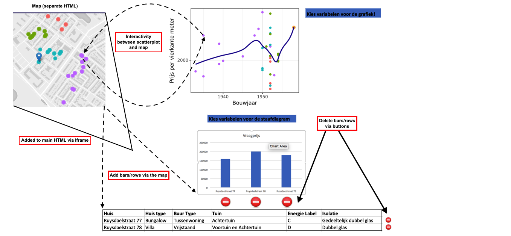

# Design Document 

This document aims to highlight the technical components of my project. 
It will do so by going over each component of the visualisation, indicating possible challenges. 
Advisable to first read the README.md to understand the project, and the purpose of each component. 

## The database

As mentioned in README.md, I received a subset of a database from Vastgoed Nederland. When consumers look up a house on http://woningwaarde.database.nl/, Vastgoed Nederland picks a subset of houses that are comparable to this house. It does so using propietary statistics. My task is to create a visualisation for any subset. The subset I received are comparable houses to the Nicholaas Ruyverstraat 77. Once I create a succesful visualisation for this subset, we will test if the visualisation works for other subsets. There are two Json files under data. The first is the available data for Nicholaas Ruyverstraat 77, the second is for the houses comparable to Nicholaas Ruyverstraat 77. Each dict in the dataset constitutes a house, containing multiple variables. 

From these two files, a single dataset containing all the houses will be created. The vast majority of variables in the dataset will be used, except for a few where there is not enough available data. This might seem like an overload, but since users can select themselves which variables they want to depict, it should not be too confusing. 

## The map 

The map is created using Mapbox library, and depicted through an Iframe on another webpage. This is to ensure that the map is only part of the webpage, allowing space for other plots and graphs. However, this creates a couple of difficulties. It is harder to attach events to elements on the map because it is in an Iframe. This is not impossible since both HTML pages are on the same domain, but requires some extra effort.

## The scatterplot

There are two parts of this scatterplot that make it different than the ones I previously built. First, users should be able to pick the x and y variable. This requires some additional effort, but is very doable. Secondly and more importantly, it is my aim to draw a line of best fit in the scatterplot. This is not necessary, but can be very beneficial to users since they can see if houses are better or worse than the general trend.

## The Barchart and the table. 

Users can choose which continuous variable they want to depict on the barchart. They should also be able to delete charts by clicking a button. Users can also choose which categorical variable they want to depict on the table. Similar to the barchart, users can delete rows with a button. Importantly, both the barchart and the table are interactive with the map. Users can add bars/rows by clicking on a house on the map. 

## Sketch 

## Code 

There are two javascript documents, and two HTML pages. The first Javascript creates a map with houses. This map is displayed on the first HTML page. That page is then put into the second and main HTML page using an Iframe. The second javascript creates the rest of the graphs. 

Overview code: Javascript #1 

* Define parameters e.g zoom/initial place of map. 
* Queue the necessary datasets. 
* After window is loaded, functions that require libraries are initialized. Includes the function:
- Make_map: Creates the map with the given parameters, adds houses tot the map at given locations

Overview code: Javascript #2 

* Define parameters e.g the height/width of barchart/scatterplot/table/map 
* Queue the necessary datasets. 
* After window is loaded, functions that require libraries are initialized. These functions include:

- Update_charts: This is a function that contains separate functions, each of which updates a different chart. Update_charts is triggered when a user clicks on a house on the map. It contains the following functions: 
-- Update_barchart: Updates the barchart
-- Update_table: Updates the table by adding a row 
-- Highlight_scatterplot: Highlights a house on the scatterplot if a user clicks on that house on the scatterplot. 

- Initialize_charts: Creates the initial version of each chart with the given parameters. The queue awaits until this function is called on. 

- Remove_row: removes a row from the table if the user clicks on the button. 
- Remove_bar: removes a bar from the barchart if the user clicks on the button. 

- Highlight_map: Highlights a house on the map if a user clicks on that house on the scatterplot.

- Create_buttons: creates buttons and dropdown menus for the barchart and table

- Update_barchart is also used for the dropdown menu of the barchart. 
- Update_scatterplot: Changes X/Y variable based on the dropdown menu. 

## Plug-ins 

In addition to the libraries described in README.md: 
* Stylesheets for Mapbox, Google and Bootstraps 

 

